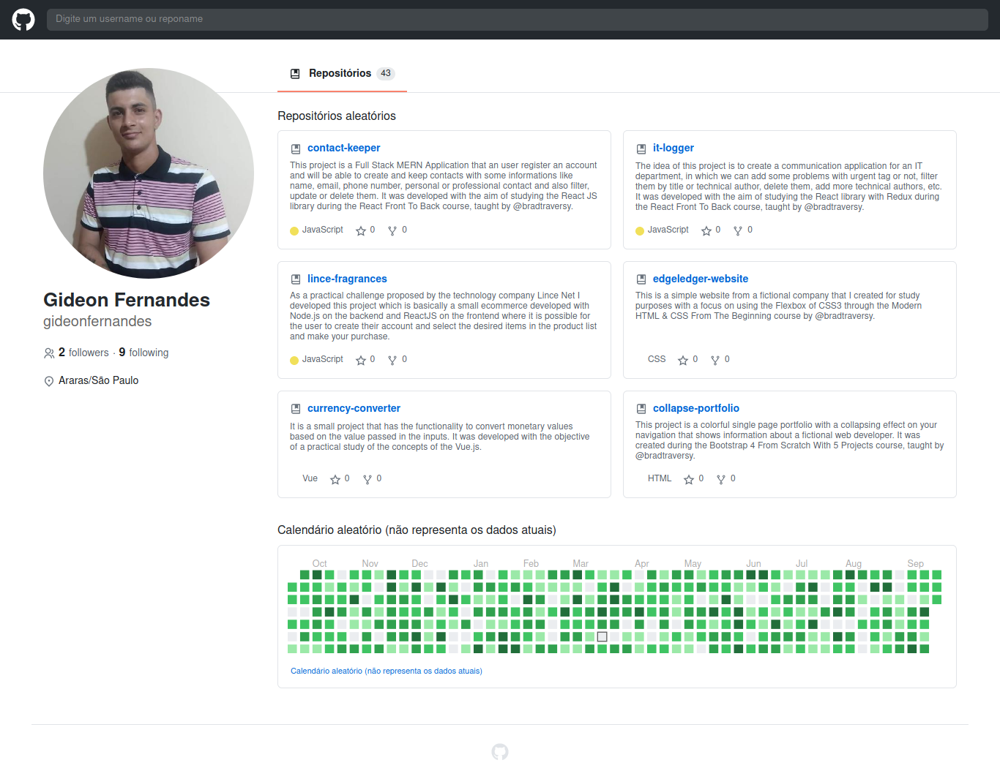
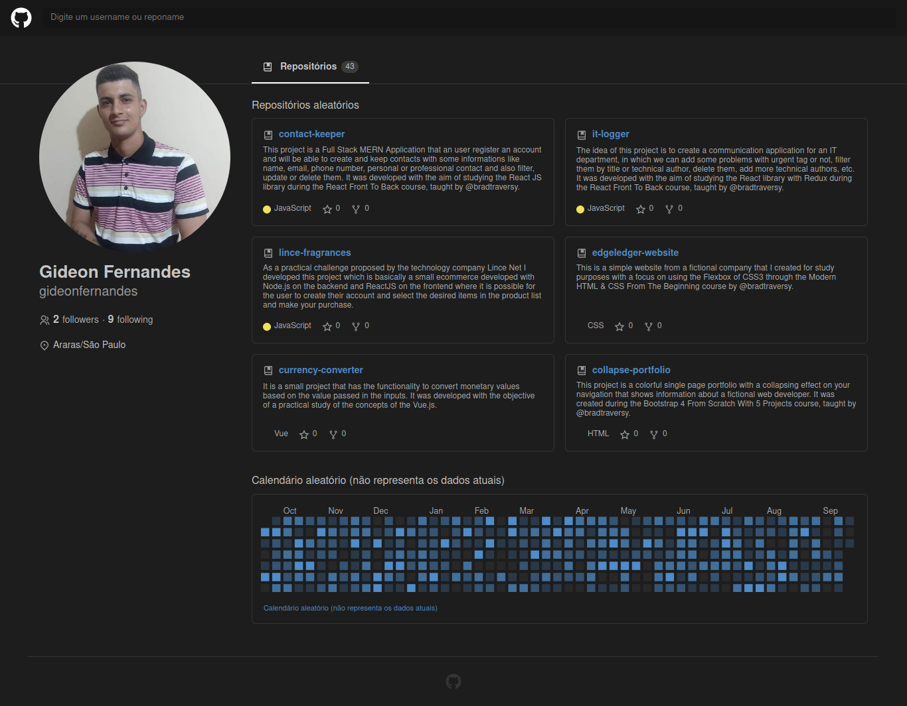

# ui-clone-github-web

## Project

***EN:*** This project is an incredible UI clone developed in React during the class taught by the great Guilherme Rods of Rocketseat. In this application in addition to faithfully cloning the original UI, we consume real data from the github API and we also implement dark mode in the project!

***PT-BR:*** Este projeto é uma incrível UI clone desenvolvida em React durante a aula ministrada pelo grande Guilherme Rods da Rocketseat. Nesta aplicação além de clonar fielmente a UI original, consumimos dados reais da API do github e implementamos também o dark mode no projeto!

This project was developed with the following technologies:

- HTML
- CSS
- ReactJS
- Typescript
- Styled Components
- React Calendar Heatmap
- Fetch API
- {...}
***

## Preview

***

## Dark Mode Preview

***

### How To Install

To clone and run this application, you'll need Git, Node.js & NPM/Yarn installed on your computer.

From your command line:

```bash
# Clone this repository
$ git clone https://github.com/gideonfernandes/ui-clone-github-web.git

# Go into the repository
$ cd ui-clone-github-web

# Install dependencies
$ yarn install

# Start server
$ yarn start

# running on port 3000
```

### License

This project is under the MIT license.
